# HMS_database
## Executive Summary
#### Despite the existence of effective and thorough healthcare systems that improve patient outcomes, there is always room for a more efficient Hospital Management System (HMS). This project aims to compile examples of previous initiatives, develop a comprehensive overview of the scope of work, and conduct a detailed analysis of the data used in hospital management systems. This overview will include various data models addressing the needs for appointment scheduling, hospital operations, and financial management.

#### This report begins with the logical design and modeling of our dataset. We start by developing an ER/EER diagram, along with the assumptions that underpin it, to visually depict the entities and their relationships. The next section transforms this logical diagram into a detailed database diagram, forming the relational schema. We then normalize the tables to ensure they meet the requirements of the third normal form (3NF). The report concludes with a concise summary of the design.

## Problem Description
#### The traditional Hospital Management System faces several difficulties, particularly with information retrieval. For instance, each patient's identification number must be unique, and this process is typically managed manually, resulting in transaction errors and making the management and security of patient information and diagnosis data both time-consuming and labor-intensive. This data model aims to enhance the hospital management system by simplifying the registration and maintenance of patient records, enabling staff to access and update information as necessary. Updates and changes can be made and stored in the databases simultaneously by administrators or receptionists.

## Contents:
#### 1. Conceptual Design
#### 1.1 EER Diagram with all assumptions
#### 1.2 Crow Foot Notation for Relationship

#### 2. Relational Schema
#### 2.1 Data Format for Every Relation

#### 3. Normalization

#### 4. SQL Statements
#### 4.1 Pre-Illumination
#### 4.2 Creation of Database with SQL Statements
#### 4.2.1 Table Creation
#### 4.2.2 A Database State

#### 5. Query Scenario Design

#### 6. Conclusion.

### 1. Conceptual Design
##### Here is the EER diagram generated based on our project description and real-life experiences.
### 1.1 EER Diagram with all assumptions.

### 1.2 Crow Foot Notation for Relationship
#### This section explores the min-max notations in the EER diagram that depict entity relationships. Table 1 offers a detailed explanation of Crow's Foot notations to enhance understanding and interpretation of these relationships within the relational database.

### 2 Relational Schema
#### The diagram illustrates the relationships between tables by demonstrating how each foreign key links to the primary key of the parent table. It serves as a blueprint for understanding how information is interconnected and retrieved in the database. For instance, including Emp_ID in the Nurse and Doctor tables enables the retrieval of their respective information when Emp_ID is queried.

### Data Format Showing ENTITY, ATTRIBUTES and DATA TYPE

## 3.0 NORMALIZATION
#### In this section, I will be applying the principles of normalization to ensure all the tables conform to 1ST Normal Form (1NF), 2ND Normal Form (2NF), and 3RD Normal Form (3NF).
## 3.1 Patient Table

#### 1NF Compliance: The table is in the First Normal Form (1NF) because it contains only atomic (indivisible) values in each column, and there are no repeating groups. This means each cell only contains one data value

#### 2NF Compliance: It is also in the Second Normal Form (2NF) because it has a primary key, “patient_id,” which uniquely identifies each row, and all non-key attributes are fully functionally dependent on the primary key (patient_ID).

#### 3NF Compliance: The table is in the Third Normal Form (3NF) because it has no transitive dependencies. All non-key attributes are directly dependent on the primary key “patient_id.”

### Functional Dependencies:

#### patient_id → patient_lastName, patient_firstName, patient_PhoneNumber, patient_bloodType, email, sickness_type, gender, admission_date, discharge_date
#### This set of functional dependencies implies that each patient’s name, phone number, blood type, email, gender, sickness, admission date, and discharge date are directly determined by their unique patient ID. As a result, the “Patient” table is in 3NF.

## 3.2 Room Table

#### 1NF Compliance: The above table is in the First Normal Form (1NF) because it contains atomic values in each column, and there are no repeating groups.

#### 2NF Compliance: It is also in the Second Normal Form (2NF) since it has a primary key, “room_id,” which uniquely identifies each row, and all non-key attributes are fully functionally dependent on the primary key.

#### 3NF Compliance: The table satisfies the Third Normal Form (3NF) because it does not contain any transitive dependencies. All non-key attributes are directly dependent on the primary key, “room_id.”

### Functional Dependencies:

#### room_id → room_type, patient_id, room_cost

#### This set of functional dependencies indicates that for each individual room, identified by “room_id,” the attributes “room_type,” “patient_id,” and “room_cost” are directly determined. There are no transitive dependencies, ensuring the “Room” table is well-structured and adheres to 3NF principles.

## 3.3 Lab_Screening Table
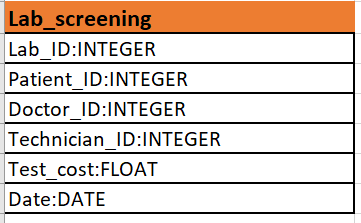
#### 1NF Compliance: The table is in the First Normal Form (1NF) as it contains atomic values in each column, and there are no repeating groups.

#### 2NF Compliance: It is in the Second Normal Form (2NF) because it has a composite primary key consisting of “Lab_id” and “patient_id,” which uniquely identifies each row, and all non-key attributes are fully functionally dependent on this composite key.

#### 3NF Compliance: The table is also in the Third Normal Form (3NF) because it has no transitive dependencies. All non-key attributes are directly dependent on the composite primary key, “Lab_id” and “patient_id.”

## Functional Dependencies:

#### (Lab_id, patient_id) → technician_id, doctor_id, test_cost, date

#### This set of functional dependencies indicates that for each specific laboratory screening instance, which is identified by the combination of “Lab_id” and “patient_id,” the attributes “technician_id,” “doctor_id,” “test_cost,” and “date” are directly determined. This structure promotes data integrity and efficiency in managing lab screening records. As a result, the table is in 3NF.

## 3.4 Doctor Table
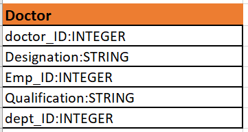
#### 1NF Compliance: Every column in the table contains atomic (indivisible) values, meeting the requirements of 1NF.

#### 2NF Compliance: The table goes beyond 1NF by having a primary key, “doctor_id,” which uniquely identifies each row. All non-key attributes are fully functionally dependent on the primary key, complying to the 2NF principles.

## Functional Dependencies:

#### doctor_id → qualifications, dept_id, designation, emp_id

#### 3NF Compliance: The table satisfies the Third Normal Form (3NF) because it does not contain any transitive dependencies. All non-key attributes are directly dependent on the primary key, “Doctor_id.”

## 3.5 Employee & Dept Table
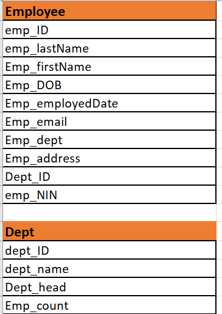
#### The above tables have no transitive or partial dependencies in any of the 2 table, So they conform to the 3NF normal form.

## 3.6 Bill Table
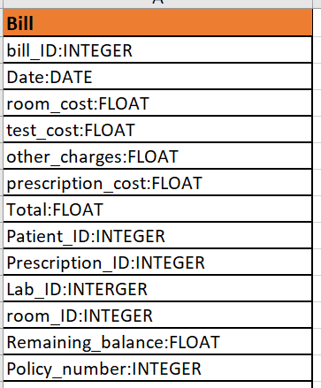
#### 1NF Compliance: The table is in the First Normal Form (1NF) because it contains atomic values in each column, and there are no repeating groups.

#### 2NF Compliance: It is also in the Second Normal Form (2NF) since it has a primary key, “bill_id,” which uniquely identifies each row, and all non-key attributes are fully functionally dependent on the primary key.

#### 3NF Compliance: The table satisfies the Third Normal Form (3NF) because it does not contain any transitive dependencies. All non-key attributes are directly dependent on the primary key, “bill_id” and “policy_number.”

## Functional Dependencies:

### bill_id, policy_number → date, room_cost, test_cost, othercharges, prescription_cost, totalremaining_balance

#### This set of functional dependencies indicates that for each payment and associated patient (identified by “bill_id” and “policy_number”), the attributes “date,” “room_cost,” “test_cost,” “othercharges,” “prescription_cost,” and “total” are directly determined. There are no transitive dependencies, ensuring that the “Bill” table is well-structured and adheres to 3NF principles.

## 3.7 Iinsurance Table
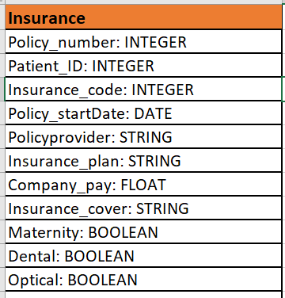
#### 1NF Compliance: The table is in the First Normal Form (1NF) because it contains atomic values in each column, and there are no repeating groups.

#### 2NF Compliance: It is also in the Second Normal Form (2NF) since it has a primary key, “policy_number,” which uniquely identifies each row, and all non-key attributes are fully functionally dependent on the primary key.

#### 3NF Compliance: The table satisfies the Third Normal Form (3NF) because it does not contain any transitive dependencies. All non-key attributes are directly dependent on the primary key, “policy_number which is the PRIMARY KEY.”

### Functional Dependencies:

#### policy_number → patient_ID, insurance_code, policy_startDate, policy_provider, insurance_plan, company_pay, insurance_cover, maternity, dental, optical

#### This set of functional dependencies indicates that for each patient and their insurance information, identified by “policy_number,” the attributes like “patient_ID,” “insurance_code,” “policy_startDate,” “policy_provider,” “insurance_plan,” “company_pay,” “insurance_cover,” “maternity,” “dental,” and “optical” are directly determined. There are no transitive dependencies, ensuring that the “Insurance” table is well-structured and adheres to 3NF principles.

## 3.8 Medicine Table
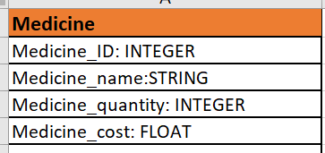
#### 1NF Compliance: All attributes must be atomic, which means that they cannot be further divided. In this table, the attributes appear atomic, so it satisfies 1NF.

#### 2NF Compliance: For a table to be in 2NF, it must first be in 1NF. Then, it must have no partial dependencies. A partial dependency occurs when an attribute depends on only a part of the candidate key.

#### Assuming that medicine_id is the candidate key, the Patient_id attribute appears to depend on the candidate key (medicine_id), indicating that it associates a patient with a specific medicine. This might be a partial dependency issue.

#### The presence of Patient_id in the “Medicine” table suggests that it might have a functional dependency on the patient for whom the medicine is prescribed. This indicates a potential partial dependency, which would mean that the table is not in 2NF. To bring the table to 2NF and resolve this issue, we created a separate table for the prescription or association between patients and medicines.

### 3.9 Prescrition Table
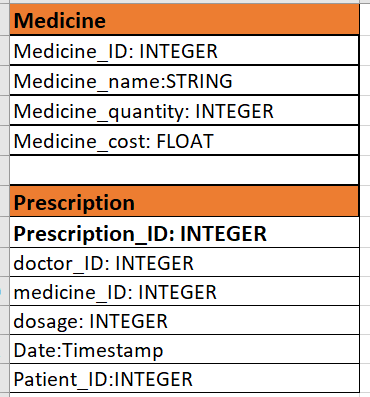
## Functional Dependencies:
#### prescription_id -> medicine_id, patient_id, date, dosage, doctor_id medicine_id -> name, medicine_cost, quantity
#### medicine_id -> name, medicine_cost, quantity

#### 3NF Compliance: Both tables are in the Third Normal Form (3NF) because they meet the requirements of 1NF (atomic attributes), 2NF (no partial dependencies), and 3NF (no transitive dependencies). In these tables, attributes depend directly on the candidate keys, and there are no indirect dependencies.

### 4.0 Medical History Table
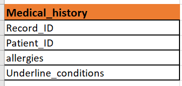
#### 1NF Compliance: The table is in the First Normal Form (1NF) because it contains atomic values in each column, and there are no repeating groups.

#### 2NF Compliance: It is also in the Second Normal Form (2NF) since it has a primary key, “record_id,” which uniquely identifies each row, and all non-key attributes are fully functionally dependent on the primary key.

#### 3NF Compliance: The table satisfies the Third Normal Form (3NF) because it does not contain any transitive dependencies. All non-key attributes are directly dependent on the primary key, “record_id.”

### Functional Dependencies:

#### record_id → allergies, underline_conditions

#### This set of functional dependencies indicates that for each patient, identified by “record_id,” the attributes “allergies” and “underline_conditions” are directly determined. There are no transitive dependencies, ensuring that the “Medical History” table is well-structured and adheres to 3NF principles.

### 4.1 Emergency Contact Table
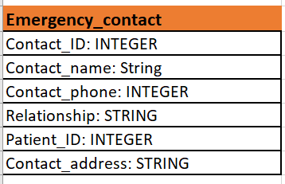
#### 1NF Compliance: The table is in the First Normal Form (1NF) as it contains atomic values in each column, and there are no repeating groups.

#### 2NF Compliance: It is also in the Second Normal Form (2NF) because it has a primary key, “contact_id,” which uniquely identifies each row, and all non-key attributes are fully functionally dependent on the primary key.

#### 3NF Compliance: The table satisfies the Third Normal Form (3NF) because it has no transitive dependencies. All non-key attributes directly depend on the primary key, “contact_id,” and “patient_id.”

### Functional Dependencies:

#### contact_id → contact_name, contact_number, relation, patient_id

#### This set of functional dependencies indicates that for each unique emergency contact identified by “contact_id,” the attributes “contact_name,” “contact_number,” “relation,” and “patient_id” are directly determined.

### 4.2 Appointment Table

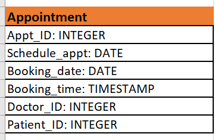
#### 1NF Compliance: The table is in the First Normal Form (1NF) because it contains atomic values in each column, and there are no repeating groups.

#### 2NF Compliance: It is also in the Second Normal Form (2NF) since it has a primary key, “Appt_id,” which uniquely identifies each row, and all non-key attributes are fully functionally dependent on the primary key.

#### 3NF Compliance: The table satisfies the Third Normal Form (3NF) because it does not contain any transitive dependencies. All non-key attributes are directly dependent on the primary keys, “Appt_id,” “Doctor_ID,” and “Patient_id.”

### Functional Dependencies:

#### Appt_id → Scheduled_on, Date, Time, Doctor_ID, Patient_id Doctor_ID → Doctor_name, Doctor_specialization Patient_id → Patient_name, Patient_date_of_birth

#### This set of functional dependencies indicates that for each appointment, identified by “Appt_id,” the attributes “Scheduled_on,” “Date,” “Time,” “Doctor_ID,” and “Patient_id” are directly determined. There are no transitive dependencies, ensuring that the “Appointment” table is well-structured and adheres to 3NF principles.

### 4.3 Nurse Table

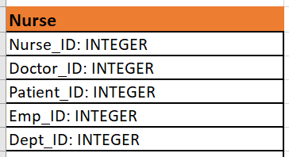
#### 1NF Compliance: The table is in the First Normal Form (1NF) as it contains atomic values in each column, and there are no repeating groups.

#### 2NF Compliance: It is also in the Second Normal Form (2NF) because it has a primary key, “nurse_id,” which uniquely identifies each row, and all non-key attributes are fully functionally dependent on the primary key.

#### 3NF Compliance: The table satisfies the Third Normal Form (3NF) because it does not contain any transitive dependencies. All non-key attributes are directly dependent on the primary key, “nurse_id.”

### Functional Dependencies:

#### nurse_ID → patient_ID, emp_ID, doctor_ID, dept_ID

#### This set of functional dependencies indicates that for each individual nurse, identified by “nurse_ID,” the attributes “patient_id” and “emp_id” are directly determined. There are no transitive dependencies, ensuring that the “Nurse” table is well-structured and adheres to 3NF principles.

### 4.4 Payroll Table

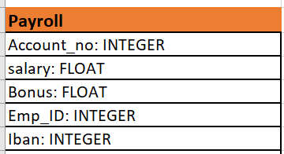
#### 1NF Compliance: The table is in the First Normal Form (1NF) because it contains atomic values in each column, and there are no repeating groups.

#### 2NF Compliance: It is also in the Second Normal Form (2NF) since it has a primary key, “account_no,” which uniquely identifies each row, and all non-key attributes are fully functionally dependent on the primary key.

#### 3NF Compliance: The table satisfies the Third Normal Form (3NF) because it does not contain any transitive dependencies. All non-key attributes are directly dependent on the primary key, “account_no.”

### Functional Dependencies:

#### account_no → salary, bonus, emp_ID, IBAN

#### This set of functional dependencies indicates that for each employee and their payroll information, identified by “account_no,” the attributes such as “salary,” “bonus,” “emp_ID,” and “IBAN” are directly determined. There are no transitive dependencies, ensuring the “Payroll” table is well-structured and adheres to 3NF principles.

### 5.0  SQL Statements
### 5.1 Pre-Illumination
#### This report outlines the implementation phase of the database project, focusing on the creation of the database, table setup, data population, and SQL queries. Our project utilizes the MySQL database management system. Part 1 is the creation of the database, including tables, all other structures as well as constraints, data type and format, Part 2 is the query scenario design and implementation along with the results. Part 3 is our conclusion of what is included in this report.

