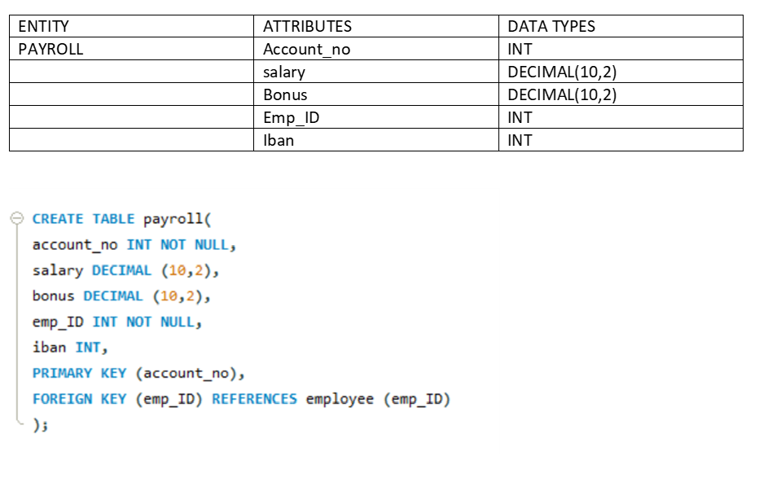

# HMS_database
## Executive Summary
#### Despite the existence of effective and thorough healthcare systems that improve patient outcomes, there is always room for a more efficient Hospital Management System (HMS). This project aims to compile examples of previous initiatives, develop a comprehensive overview of the scope of work, and conduct a detailed analysis of the data used in hospital management systems. This overview will include various data models addressing the needs for appointment scheduling, hospital operations, and financial management.

#### This report begins with the logical design and modeling of our dataset. We start by developing an ER/EER diagram, along with the assumptions that underpin it, to visually depict the entities and their relationships. The next section transforms this logical diagram into a detailed database diagram, forming the relational schema. We then normalize the tables to ensure they meet the requirements of the third normal form (3NF). The report concludes with a concise summary of the design.

## Problem Description
#### The traditional Hospital Management System faces several difficulties, particularly with information retrieval. For instance, each patient's identification number must be unique, and this process is typically managed manually, resulting in transaction errors and making the management and security of patient information and diagnosis data both time-consuming and labor-intensive. This data model aims to enhance the hospital management system by simplifying the registration and maintenance of patient records, enabling staff to access and update information as necessary. Updates and changes can be made and stored in the databases simultaneously by administrators or receptionists.

## Contents:
#### 1. Conceptual Design
#### 1.1 EER Diagram with all assumptions
#### 1.2 Crow Foot Notation for Relationship

#### 2. Relational Schema
#### 2.1 Data Format for Every Relation

#### 3. Normalization

#### 4. SQL Statements
#### 4.1 Pre-Illumination
#### 4.2 Creation of Database with SQL Statements
#### 4.2.1 Table Creation
#### 4.2.2 A Database State

#### 5. Query Scenario Design

#### 6. Conclusion.

### 1. Conceptual Design
##### Here is the EER diagram generated based on our project description and real-life experiences.
### 1.1 EER Diagram with all assumptions.

### 1.2 Crow Foot Notation for Relationship
#### This section explores the min-max notations in the EER diagram that depict entity relationships. Table 1 offers a detailed explanation of Crow's Foot notations to enhance understanding and interpretation of these relationships within the relational database.

### 2 Relational Schema
#### The diagram illustrates the relationships between tables by demonstrating how each foreign key links to the primary key of the parent table. It serves as a blueprint for understanding how information is interconnected and retrieved in the database. For instance, including Emp_ID in the Nurse and Doctor tables enables the retrieval of their respective information when Emp_ID is queried.

### Data Format Showing ENTITY, ATTRIBUTES and DATA TYPE

## 3.0 NORMALIZATION
#### In this section, I will be applying the principles of normalization to ensure all the tables conform to 1ST Normal Form (1NF), 2ND Normal Form (2NF), and 3RD Normal Form (3NF).
## 3.1 Patient Table

#### 1NF Compliance: The table is in the First Normal Form (1NF) because it contains only atomic (indivisible) values in each column, and there are no repeating groups. This means each cell only contains one data value

#### 2NF Compliance: It is also in the Second Normal Form (2NF) because it has a primary key, “patient_id,” which uniquely identifies each row, and all non-key attributes are fully functionally dependent on the primary key (patient_ID).

#### 3NF Compliance: The table is in the Third Normal Form (3NF) because it has no transitive dependencies. All non-key attributes are directly dependent on the primary key “patient_id.”

### Functional Dependencies:

#### patient_id → patient_lastName, patient_firstName, patient_PhoneNumber, patient_bloodType, email, sickness_type, gender, admission_date, discharge_date
#### This set of functional dependencies implies that each patient’s name, phone number, blood type, email, gender, sickness, admission date, and discharge date are directly determined by their unique patient ID. As a result, the “Patient” table is in 3NF.

